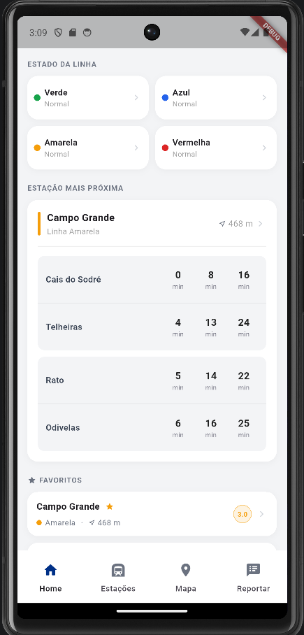
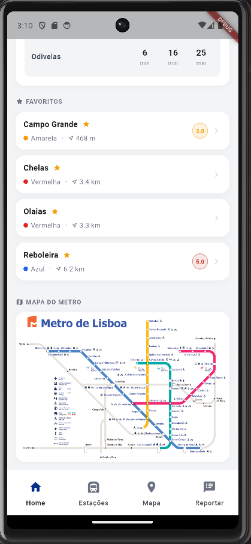
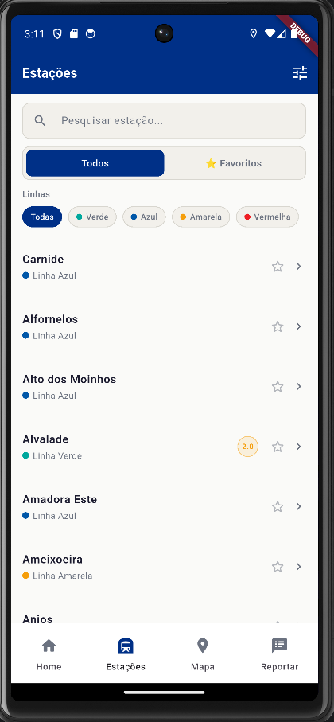
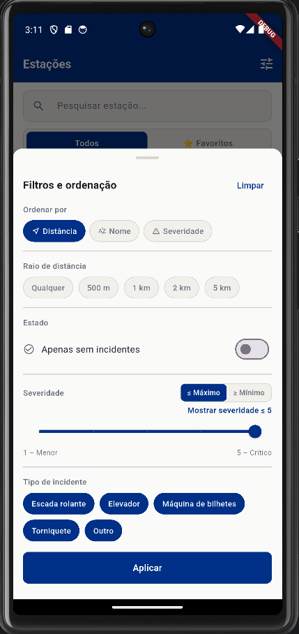
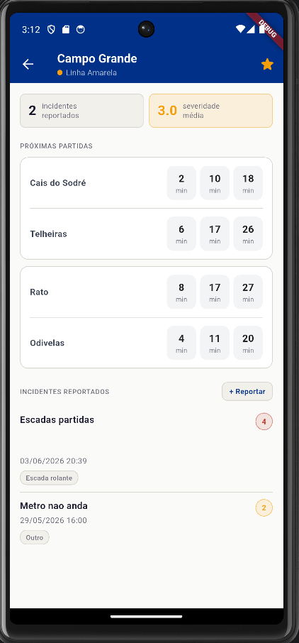
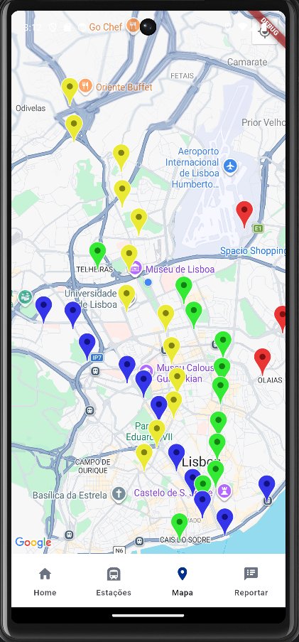
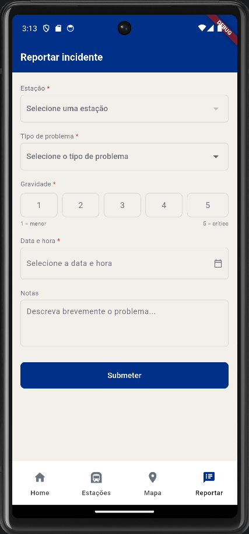

[](https://classroom.github.com/a/iNsiMShf)

## AUTHORS.txt

```
a22203178;Daniel Rodrigues
a22207476;Guilherme Ribeiro
```

## Ecrãs

| Dashboard | Dashboard (cont.) |
|-----------|-------------------|
|||

| Lista | Filtros |
|-------|---------|
|  |  |

| Detalhes | Mapa |
|----------|------|
|  |  |

| Formulário |
|------------|
|  |

## Funcionalidades implementadas

### Testes automáticos dos alunos
- Testes aos componentes criativos criados para na dashboard e sua navegação
- Filtragem e pesquisa da listagem de estações

### Dashboard
**Estado das linhas**
- Grelha com o estado de cada linha (normal / perturbada)
- Ao tocar na linha navega para a lista filtrada por essa linha

**Estação mais próxima**
- Nome e distância da estação mais próxima
- Próximos metros por plataforma com minutos de espera
- Toque navega para o ecrã de detalhe da estação

**Favoritos**
- Lista de estações marcadas como favoritas
- Toque navega para o ecrã de detalhe da estação

**Mapa das linhas**
- Toque abre a imagem em ecrã completo com zoom interativo

### Apresentação das estações — Lista
- Nome da estação com ícone de favorito
- Linha com cor identificativa, distância ao utilizador e severidade média
- Botão de voltar quando acedido pelos favoritos na dashboard

### Apresentação das estações — Lista com pesquisa
- Barra de pesquisa
- Alternar entre todas as estações e apenas favoritas
- Butões de filtragem por linha
- Filtros avançados:
  - Ordenação por distância, nome ou severidade
  - Raio de distância (500m, 1km, 2km, 5km)
  - Apenas estações sem incidentes
  - Severidade mínima ou máxima com slider
  - Exclusão por tipo de incidente
- Estado vazio com opção de limpar filtros

### Apresentação das estações — Mapa
- Pins de estações com core representativa da linha de metro
- Ao clicar em cada pin aparece a distância do utilizador à estação e a média de incidentes
- Ao clicar novamente vamos para os detalhes da estação

### Detalhe da estação
- Nome da estação e linha na AppBar com cor identificativa
- Número de incidentes reportados e Severidade média com cor conforme nível de risco
- Tempos de espera para os próximos metros por plataforma

### Detalhe da estação — apresentar incidentes
- Lista de incidentes ordenada do mais recente para o mais antigo
- Cada incidente mostra descrição, data/hora, tipo e severidade individual
- Estado vazio quando não existem incidentes
- Botão `+ Reportar` junto ao título navega para o formulário com a estação pré-selecionada

### Registo de incidentes
- Seleção de estação (pré-selecionada quando acedido pelo ecrã de detalhes)
- Seleção do tipo de problema
- Date/time picker
- Gravidade de 1 a 5 com botões
- Notas opcionais
- Validação de todos os campos obrigatórios antes da submissão
- Feedback de erro por campo e feedback de sucesso após submissão
- Botão de voltar quando acedido pelo ecrã de detalhe

## Resumo de funcionalidades por parte

### Parte 1
- Pesquisa e filtros na lista de estações, incluindo favoritos, linha, ordem, raio, severidade e exclusão por tipo de incidente.
- Uso de geolocalização em vários ecrãs: dashboard, lista de estações e detalhe da estação.
- Suporte a funcionamento offline com dados locais e experiência contínua quando a rede não está disponível.
- Navegação e UI consistentes entre dashboard, lista, detalhe e registo de incidentes.

### Parte 2
- Apresentação das estações em lista usando API online com dados atualizados.
- Apresentação das estações em mapa com Google Maps e markers.
- Detalhe da estação com informação obrigatória do nome, linha, distância, incidentes e tempos de espera.
- Apresentar incidentes vindos da base de dados na página de detalhe.
- Registo de incidentes na BD com validação e feedback.
- Vídeo de apresentação incluído como suporte à entrega.

## Arquitetura da aplicação

## Arquitetura da aplicação

A arquitetura da aplicação foi desenhada com base em princípios de software limpo para garantir manutenibilidade, testabilidade e escalabilidade.

- **Injeção de Dependências com Provider**: Utilizamos `Provider` em `main.dart` para injetar dependências como `HttpMetroDataSource`, `SqfliteMetroDataSource`, `ConnectivityModule`, `LocationModule` e `GenericDataSource` na árvore de widgets. Esta prática desacopla a interface de utilizador da lógica de dados, permitindo que os serviços sejam facilmente substituídos ou simulados durante os testes.
- **Padrão de Repositório / Fonte de Dados**: A aplicação abstrai as fontes de dados em classes distintas. `HttpMetroDataSource` gere as chamadas HTTP, `SqfliteMetroDataSource` gere o armazenamento local e `GenericDataSource` oferece operações comuns. As ecrãs consomem estes serviços através de `context.read<T>()`, mantendo a interface de utilizador leve e focada na apresentação.
- **Estratégia Offline-First**: A aplicação verifica a conectividade de rede através do `ConnectivityModule`. Quando não há internet, a lógica recorre de forma transparente aos dados locais armazenados em `SqfliteMetroDataSource`, garantindo acesso contínuo às informações essenciais.

## Persistência e Conectividade

- **Online**: Consumo de dados atualizados a partir da API remota através de `HttpMetroDataSource`.
- **Offline**: Cache local em SQLite com `SqfliteMetroDataSource`, permitindo consulta dos dados quando a rede não está disponível.
- **Fallback de Conectividade**: O `ConnectivityModule` determina quando usar a fonte remota ou o cache local para assegurar que a aplicação continua a funcionar.

## Estados de Fallback

- **Sem Conectividade**: Dados servidos do cache SQLite com indicador de operação offline e continuidade de navegação.
- **Lista Vazia**: Mensagens contextuais para indicar que não há estações ou filtros não retornaram resultados.
- **Sem Incidentes**: Estado vazio com call-to-action para registar o primeiro incidente na estação.
- **Geolocalização Negada**: A aplicação mantém o funcionamento principal sem cálculo de distâncias, apresentando o conteúdo disponível.

## Previsão de Nota

* (Parte 1) Após muita consideração, chegamos a conclusão de 18,27 valores.
* (Parte 2) Após mais consideração e tendo em conta a nota da parte 1, acreditamos conseguir alcançar o valor de 18,66 valores.

## Video de Apresentação:

* https://youtu.be/A15Qe-2_fk0