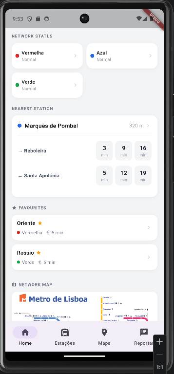

[](https://classroom.github.com/a/iNsiMShf)

## AUTHORS.txt

```
a22203178;Daniel Rodrigues
a22207476;Guilherme Ribeiro
```

## Ecrãs

* Dashboard
  * *Ecrã dashboard com informações pertinentes, estação mais proxima, status das linhas, favoritos e o mapa das linhas.
  *  
* Lista
  * Lista de estações de metro, com barra de pesquisa, toggle de favoritos e filtros adicionais.
  * 
* Detalhes de Estação
  * Numero e lista de incidentes reportados e a severidade.
  * 
* Mapa
  * Mapa da localização do utilizador com os metros proximos apresentados.
  * 
* Formulário de Incidente
  * Formulário para preencher um novo incidente, escolher estação, tipo de problema, gravidade, data / hora e notas sobre o incidente.
  * 

## Funcionalidades
* Implementamos funcionalidades pedidas, sendo elas:
  * Dashboard com informações extras, como estação mais proxima status de linhas etc...
  * Ecrã de lista com pesquisa funcional e filtros.
  * Mapa implementado (imagem).
  * Da lista é possível ir até aos detalhes de cada estação com uma lista de incidentes reportados.
  * Formulario implementado com escolha para reportar incidentes.


## Previsão de Nota

* Após muita consideração, chegamos a conclusão de 17,64 valores.