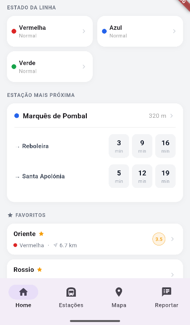
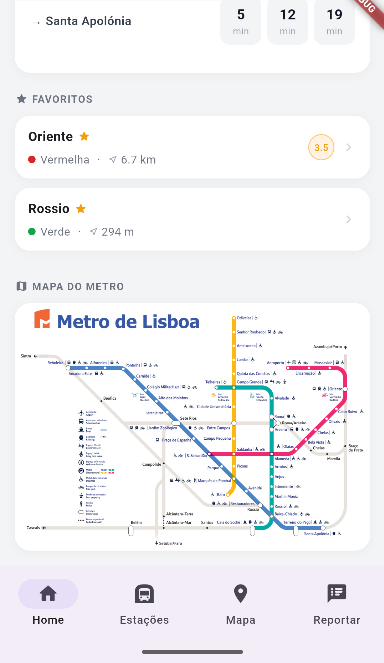
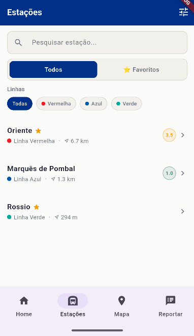
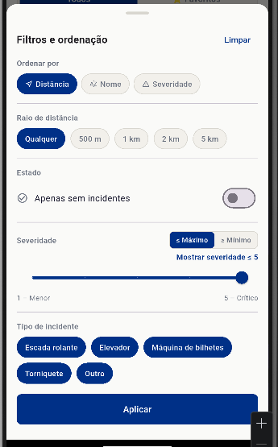
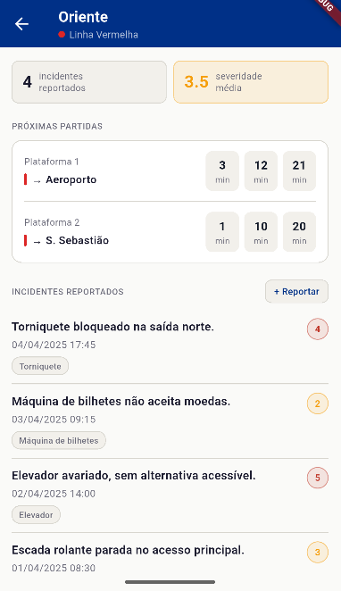
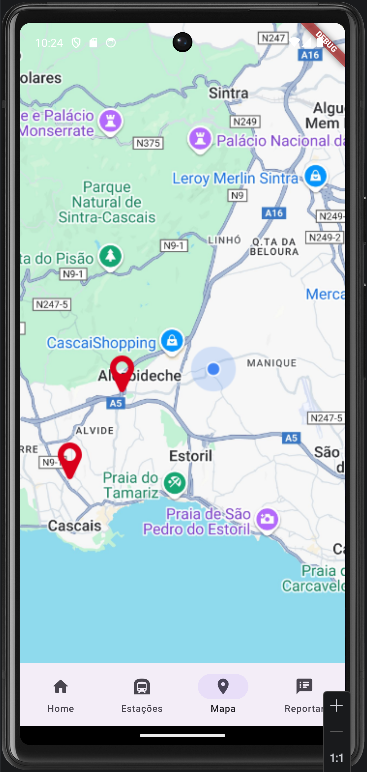
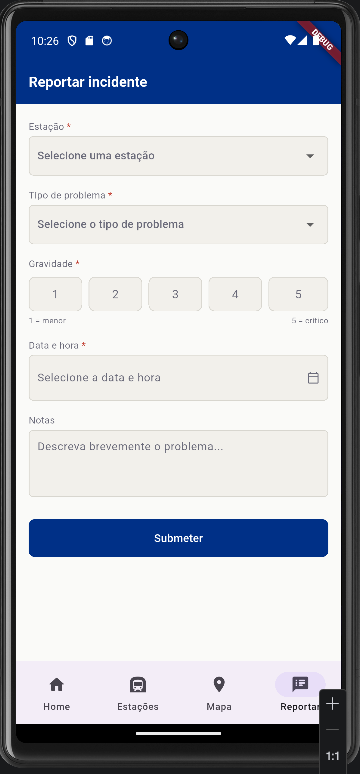

[](https://classroom.github.com/a/iNsiMShf)

## AUTHORS.txt

```
a22203178;Daniel Rodrigues
a22207476;Guilherme Ribeiro
```

## Ecrãs

* Dashboard
  * *Ecrã dashboard com informações pertinentes, estação mais proxima, status das linhas, favoritos e o mapa das linhas.
  *  
* Lista
  * Lista de estações de metro, com barra de pesquisa, toggle de favoritos e filtros adicionais.
  * 
* Detalhes de Estação
  * Numero e lista de incidentes reportados e a severidade.
  * 
* Mapa
  * Mapa da localização do utilizador com os metros proximos apresentados.
  * 
* Formulário de Incidente
  * Formulário para preencher um novo incidente, escolher estação, tipo de problema, gravidade, data / hora e notas sobre o incidente.
  * 

## Funcionalidades implementadas

### Testes automáticos dos alunos
- Testes aos componentes criativos criados para na dashboard e sua navegação
- Filtragem e pesquisa da listagem de estações

### Dashboard
**Estado das linhas**
- Grelha com o estado de cada linha (normal / perturbada)
- Ao tocar na linha navega para a lista filtrada por essa linha

**Estação mais próxima**
- Nome e distância da estação mais próxima
- Próximos metros por plataforma com minutos de espera
- Toque navega para o ecrã de detalhe da estação

**Favoritos**
- Lista de estações marcadas como favoritas
- Toque navega para o ecrã de detalhe da estação

**Mapa das linhas**
- Toque abre a imagem em ecrã completo com zoom interativo

### Apresentação das estações — Lista
- Nome da estação com ícone de favorito
- Linha com cor identificativa, distância ao utilizador e severidade média
- Botão de voltar quando acedido pelos favoritos na dashboard

### Apresentação das estações — Lista com pesquisa
- Barra de pesquisa
- Alternar entre todas as estações e apenas favoritas
- Butões de filtragem por linha
- Filtros avançados:
    - Ordenação por distância, nome ou severidade
    - Raio de distância (500m, 1km, 2km, 5km)
    - Apenas estações sem incidentes
    - Severidade mínima ou máxima com slider
    - Exclusão por tipo de incidente
- Estado vazio com opção de limpar filtros

### Apresentação das estações — Mapa
- Imagem do google maps implementada

### Detalhe da estação
- Nome da estação e linha na AppBar com cor identificativa
- Número de incidentes reportados e Severidade média com cor conforme nível de risco
- Tempos de espera para os próximos metros por plataforma

### Detalhe da estação — apresentar incidentes
- Lista de incidentes ordenada do mais recente para o mais antigo
- Cada incidente mostra descrição, data/hora, tipo e severidade individual
- Estado vazio quando não existem incidentes
- Botão `+ Reportar` junto ao título navega para o formulário com a estação pré-selecionada

### Registo de incidentes
- Seleção de estação (pré-selecionada quando acedido pelo ecrã de detalhes)
- Seleção do tipo de problema
- Date/time picker
- Gravidade de 1 a 5 com botões
- Notas opcionais
- Validação de todos os campos obrigatórios antes da submissão
- Feedback de erro por campo e feedback de sucesso após submissão
- Botão de voltar quando acedido pelo ecrã de detalhe

## Previsão de Nota

* Após muita consideração, chegamos a conclusão de 18,27 valores.