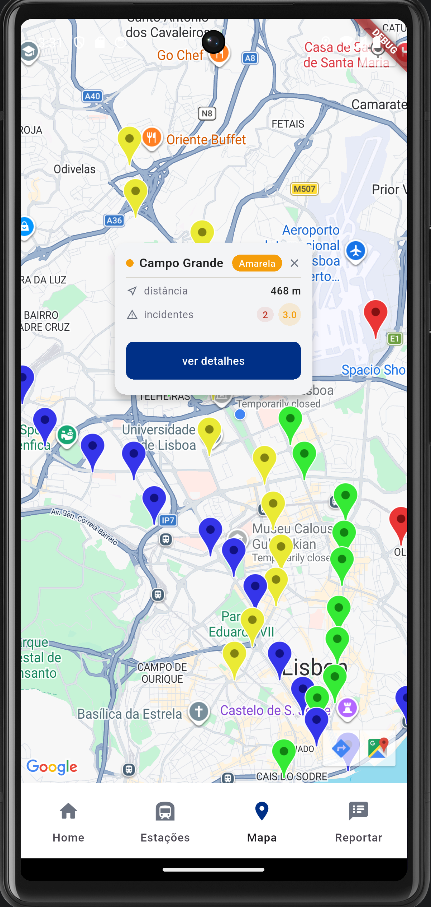

# Lisbon Subway

A Flutter app (Android & iOS) built for a Mobile Computing university discipline. Shows real-time information about Lisbon's metro network including live line status, station details, incident reporting, and GPS-based nearest station detection.

## Screenshots

| Dashboard | Dashboard (cont.) |
|-----------|-------------------|
|||

| List | Search Filters                                     |
|------|----------------------------------------------------|
|  |  |

| Map | Map (cont.) |
|-----|-------------|
||  |

| Incident Report                                | Station details                            |
|------------------------------------------------|--------------------------------------------|
|  |  |

## Features

- **Dashboard** with live line status, nearest station by GPS, favourites list, and an interactive metro map
- **Station list** with search, line filters, favourites tab, and advanced filters (sort, radius, severity, incident type)
- **Map** with Google Maps markers colour-coded per line and a callout card showing distance and severity
- **Station detail** with incident list, average severity, and next arrivals per platform
- **Incident reporting** with station selection, incident type selector, date/time picker, severity rating, and field validation
- **Offline support** via SQLite cache with transparent fallback when offline

## Architecture

Built with the repository pattern and dependency injection via Provider. All data sources (`HttpMetroDataSource`, `SqfliteMetroDataSource`, `GenericDataSource`) are injected at the root and consumed via `context.read<T>()`. `MetroRepository` decides whether to fetch from the API or local cache based on connectivity, keeping data logic out of the UI layer.

## Tech Stack

| Area | Technology |
|------|------------|
| Framework | Flutter / Dart |
| State management | Provider |
| Local database | sqflite (SQLite) |
| Maps | Google Maps Flutter |
| Location | location package |

## Data Source

Metro de Lisboa open API — [EstadoServicoML v1.0.1](https://api.metrolisboa.pt/store/apis/info?name=EstadoServicoML&version=1.0.1&provider=admin)

## Setup

1. Add your Google Maps API key and Metro de Lisboa API consumer key and secret
2. Run `flutter pub get`
3. Run `flutter run`

## Demo

https://youtu.be/A15Qe-2_fk0